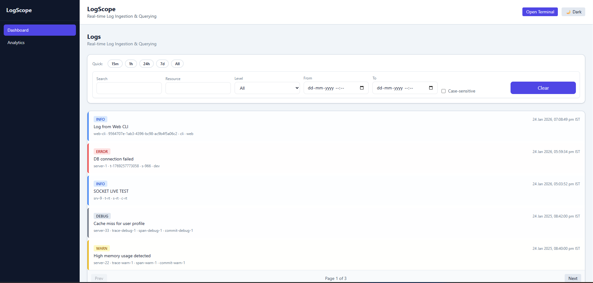
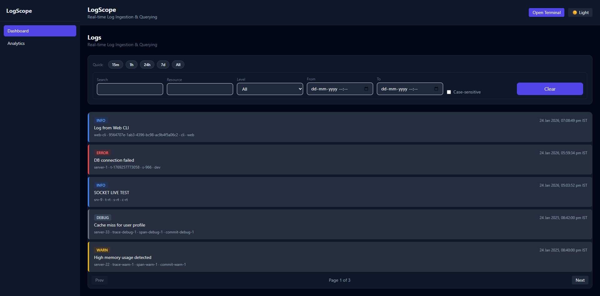
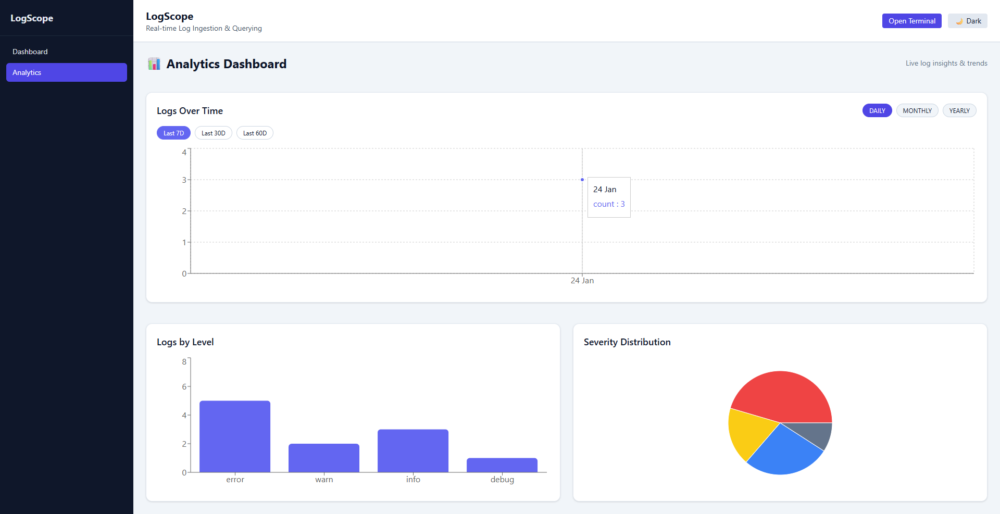
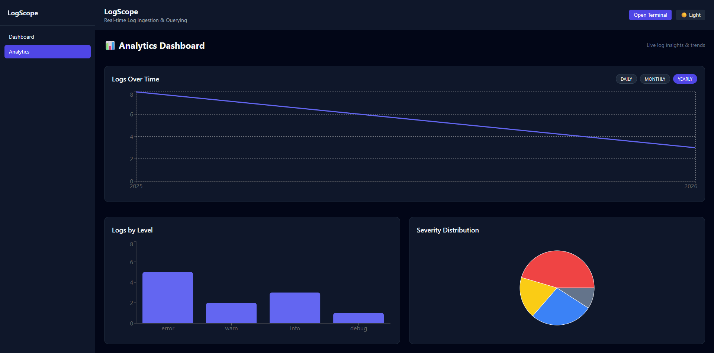
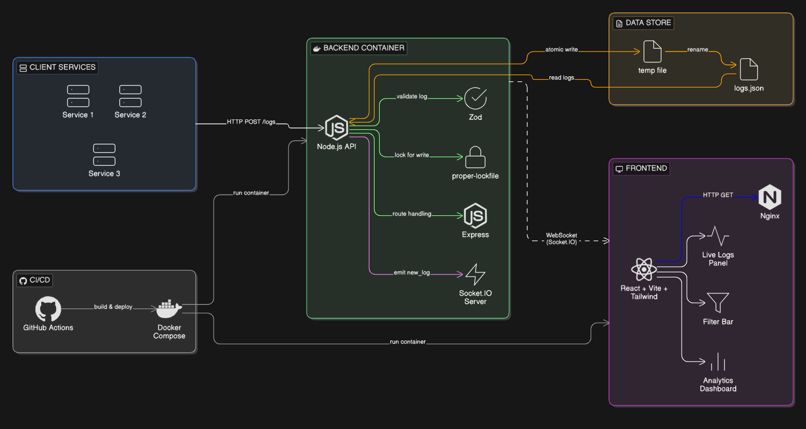

# LogScope 🔍  
**Real-Time Log Ingestion & Querying System**

[](LICENSE)\
[]\
[]\
[]\
[]\
[]

LogScope is a full-stack, Dockerized log ingestion and querying platform inspired by **Datadog, Grafana Loki, and Splunk**.  
It allows developers to send logs from any service, persist them in a JSON file, and query them in real time via a rich React UI.

---
## 📑 Table of Contents

- [Features](#features)
- [UI Preview](#ui-preview)
- [Architecture Diagram](#architecture-diagram)
- [Learn the Technologies Used](#learn-the-technologies-used)
- [Monorepo Structure](#monorepo-structure)
- [Project Dependencies](#project-dependencies)
- [Installation & Setup](#installation)
- [API Reference](#api-reference)
- [Filtering Logic](#filtering-logic)
- [Analytics](#analytics)
- [Docker Architecture](#docker-architecture)
- [CI/CD Pipeline](#cicd)
- [Development (without Docker)](#dev)
- [Example Test](#testing)
- [Tech Stack](#tech-stack)
- [Design Decisions](#design-decisions)
- [Terminal UI (Future Scope)](#terminal-ui)
- [Contributing](#contributing)
- [Author](#author)


<a id="features"></a>
## 🚀 Features

### 🔹 Backend
- `POST /logs` — Ingest structured logs  
- `GET /logs` — Query logs using multiple filters  
- JSON file datastore (no database)  
- Atomic file writes + lock protection  
- Real-time updates via WebSockets (Socket.IO)  
- Safe schema validation (Zod)  

### 🔹 Frontend
- Full-text message search (debounced)  
- Filters:
  - Level (error, warn, info, debug)
  - resourceId
  - Date/time range  
- AND-combined filtering logic  
- Real-time log streaming  
- Color-coded severity indicators  
- Analytics dashboard (Recharts)  

### 🔹 DevOps
- Dockerized frontend + backend  
- `docker compose up` → full stack  
- GitHub Actions CI/CD → Docker Hub  
- Nginx static serving for frontend  
- Volume-backed persistence  

---
<a id="ui-preview"></a>
## 📸 UI Preview

Below are real screenshots from the LogScope interface, showcasing the dashboard, analytics, and the upcoming terminal UI.

### 📊 Dashboard
The main control center where logs are streamed, filtered, and inspected in real time.
**LIGHT MODE**


**DARK MODE**



### 📈 Analytics View
Provides visual insights such as log counts by level and real-time trend analysis.
**LIGHT MODE**

**DARK MODE**


### 🖥️ Terminal UI (Future Scope)
An experimental command-based interface that will allow users to query and analyze logs using CLI-style commands.


-----

<a id="architecture-diagram">
  
## Architecture Diagram



<a id="learn-the-technologies-used"></a>
## 📚 Learn the Technologies Used

If you are new to any of the tools used in this project, you can explore their official documentation below:

---

### ⚛️ React
> A JavaScript library for building user interfaces  
🔗 https://react.dev/

---

### 🌐 Node.js
> JavaScript runtime for building scalable backend services  
🔗 https://nodejs.org/en/docs

---

### 🚀 Express.js
> Minimal and flexible Node.js web framework  
🔗 https://expressjs.com/

---

### 🔌 Socket.IO
> Real-time bidirectional communication between client and server  
🔗 https://socket.io/docs/v4/

---

### 📊 Recharts
> Charting library for React  
🔗 https://recharts.org/en-US/

---

### 🎨 Tailwind CSS
> Utility-first CSS framework  
🔗 https://tailwindcss.com/docs

---

### 🐳 Docker
> Platform to build, run, and ship applications in containers  
🔗 https://docs.docker.com/

---

### 🔁 GitHub Actions (CI/CD)
> Automate build, test, and deployment pipelines  
🔗 https://docs.github.com/en/actions

---

### 🗄️ Nginx
> High-performance web server for static content  
🔗 https://nginx.org/en/docs/

---

This section helps beginners quickly learn the stack used in **LogScope**.

<a id="monorepo-structure"></a>
## 📁 Monorepo Structure


```bash
log-ingestion/
├── .github/
│   └── workflows/
│       └── docker-ci.yml
│
├── docker-ci.yml
├── docker-compose.yml
│
├── backend/
│   ├── data/
│   │   └── logs.json
│   │
│   ├── node_modules/
│   │
│   ├── routes/
│   │   └── logs.js
│   │
│   ├── docs/
│   │   └── apidocgen.md
│   │
│   ├── Dockerfile
│   ├── package.json
│   ├── package-lock.json
│   └── server.js
│
├── frontend/
│   ├── node_modules/
│   ├── public/
│   │   └── vite.svg
│   │
│   ├── src/
│   │   ├── api/
│   │   │   └── logsApi.js
│   │   │
│   │   ├── assets/
│   │   │   └── react.svg
│   │   │
│   │   ├── components/
│   │   │   ├── FilterBar/
│   │   │   │   └── FilterBar.jsx
│   │   │   │
│   │   │   ├── LogChart/
│   │   │   │   └── LogChart.jsx
│   │   │   │
│   │   │   ├── LogsList/
│   │   │   │   └── LogsList.jsx
│   │   │   │
│   │   │   ├── LogsPanel/
│   │   │   │   └── LogsPanel.jsx
│   │   │   │
│   │   │   ├── WebUI/
│   │   │   │   └── WebUI.jsx
│   │   │   │
│   │   │   └── sidebar.jsx
│   │   │
│   │   ├── hooks/
│   │   │   └── useLogs.js
│   │   │
│   │   ├── layout/
│   │   │   └── shell.jsx
│   │   │
│   │   ├── pages/
│   │   │   └── Dashboard.jsx
│   │   │
│   │   ├── services/
│   │   │   └── socket.js
│   │   │
│   │   ├── styles/
│   │   │   └── app.css
│   │   │
│   │   ├── App.jsx
│   │   ├── App.css
│   │   ├── index.css
│   │   └── main.jsx
│   │
│   ├── Dockerfile
│   ├── nginx.conf
│   ├── .dockerignore
│   ├── .gitignore
│   ├── eslint.config.js
│   ├── index.html
│   ├── package.json
│   ├── package-lock.json
│   ├── postcss.config.js
│   ├── tailwind.config.js
│   └── vite.config.js
│
└── README.md
```
<a id="project-dependencies"></a>
## 📦 Project Dependencies

This project uses modern libraries for real-time communication, UI, validation, and DevOps-ready workflows.

---

### 🎨 Frontend Dependencies

| Package | Purpose |
|--------|---------|
| react | Core UI library |
| react-dom | DOM renderer for React |
| react-router-dom | Client-side routing |
| framer-motion | Animations & transitions |
| react-hot-toast | Toast notifications |
| recharts | Analytics & data visualization |
| socket.io-client | Real-time log streaming |
| vite | Frontend build tool |
| tailwindcss | Utility-first CSS framework |
| postcss | CSS processing |
| autoprefixer | Vendor prefixing |
| eslint | Linting & code quality |

---

### 🧠 Backend Dependencies

| Package | Purpose |
|--------|---------|
| express | REST API server |
| cors | Cross-origin support |
| fs-extra | File system utilities |
| proper-lockfile | Atomic file locking |
| socket.io | Real-time WebSocket server |
| zod | Schema validation |

---

### 🛠 Dev & Build Tooling

| Tool | Purpose |
|------|---------|
| vite | Fast dev & production builds |
| eslint | Code linting |
| tailwindcss | Styling framework |
| postcss | CSS transformer |
| GitHub Actions | CI/CD automation |
| Docker | Containerization |
| Nginx | Frontend static serving |

<a id="installation"></a>
## ⚙️ Installation & Setup
### 1️⃣ Clone
```
git clone https://github.com/your-username/logscope.git
cd log-ingestion
```
| Service     | URL                         |
|------------|-----------------------------|
| Frontend   | http://localhost:5173       |
| Backend API| http://localhost:3001/logs  |

### 2️⃣ Docker 
```
docker compose up --build

```

<a id="api-reference"></a>
## 🔌 API Reference

### POST /logs

Ingest a structured log entry.

#### Request Body

```json
{
  "level": "error",
  "message": "DB connection failed",
  "resourceId": "server-1",
  "timestamp": "2026-01-24T12:29:34.466Z",
  "traceId": "t-1769",
  "spanId": "s-966",
  "commit": "dev",
  "metadata": { "host": "prod" }
}
```
### GET /logs (Filters)

Query logs using multiple filters.

#### Example Requests
```bash
/logs?level=error&message=db&resourceId=server-1
/logs?from=2026-01-23T00:00:00Z&to=2026-01-26T00:00:00Z
```
<a id="filtering-logic"></a>
## 🧠 Filtering Logic

All filters use **AND** logic:

```js
results.filter(log =>
  matchesLevel &&
  matchesMessage &&
  matchesResource &&
  matchesDateRange
);
```

```bash
/logs?level=error&message=db&resourceId=server-1
/logs?from=2026-01-23T00:00:00Z&to=2026-01-26T00:00:00Z
```
<a id="analytics"></a>
## 📊 Analytics

- Log count by level

- Uses Recharts

- Auto-updates based on current filters

<a id="docker-architecture"></a>
## 🐳 Docker Architecture
```
[ Browser ]
     ↓
[ Frontend (Nginx) ]
     ↓
[ Backend (Node.js) ]
     ↓
[ logs.json volume ]

```
<a id="cicd"></a>

## 🔁 CI/CD Pipeline (GitHub Actions + Docker Hub)

This project uses **GitHub Actions** to automatically build, test, and deploy the application whenever code is pushed to the `main` branch.

The pipeline:
- Builds **Frontend** and **Backend** Docker images
- Tags them with `latest`
- Pushes them to **Docker Hub**
- Can be extended for cloud deployment (AWS, GCP, etc.)

---

## 📌 Workflow Trigger

The pipeline runs automatically when:

```txt

Trigger: push to main

```
### 🔐 GitHub Secrets Setup
To keep credentials secure, Docker Hub credentials are stored in GitHub Secrets.

#### Required Secrets
```
DOCKER_USERNAME
DOCKER_PASSWORD

```
### 🧾 Step 1: Create Docker Hub Access Token (Recommended)

Instead of using your real Docker password, generate a Docker Hub Access Token.

### 🔹 How to Generate Docker Hub Token

1) Go to: https://hub.docker.com/

2) Login → Click your profile (top right)

3) Open Account Settings

4) Go to Security

5) Click New Access Token

6) Give it a name (e.g. github-ci)

7) Set permission: Read, Write

8) Click Generate

9) Copy the token (you will see it only once)

### 🧾 Step 2: Add Secrets to GitHub
1. Open your GitHub repository
2. Go to Settings → Secrets and variables → Actions
3. Click New repository secret
4. Add:


--------------

## 📄 docker-ci.yml (GitHub Actions Workflow)
Create this file:
```
.github/workflows/docker-ci.yml

```
### docker-ci.yml
```
name: LogScope CI/CD Pipeline

on:
  push:
    branches:
      - main

jobs:
  build-and-push:
    runs-on: ubuntu-latest

    steps:
      - name: Checkout Code
        uses: actions/checkout@v4

      - name: Login to Docker Hub
        uses: docker/login-action@v3
        with:
          username: ${{ secrets.DOCKER_USERNAME }}
          password: ${{ secrets.DOCKER_PASSWORD }}

      - name: Build Backend Image
        run: |
          docker build -t ${{ secrets.DOCKER_USERNAME }}/logscope-backend:latest ./backend

      - name: Build Frontend Image
        run: |
          docker build -t ${{ secrets.DOCKER_USERNAME }}/logscope-frontend:latest ./frontend

      - name: Push Backend Image
        run: |
          docker push ${{ secrets.DOCKER_USERNAME }}/logscope-backend:latest

      - name: Push Frontend Image
        run: |
          docker push ${{ secrets.DOCKER_USERNAME }}/logscope-frontend:latest

```
### How to Test the CI/CD Pipeline
1. Make any small change in code
2. Commit and push to main

```
git add .
git commit -m "trigger ci"
git push origin main

```
3. Go to **GitHub → Actions**
4. Click the running workflow
5. Watch logs for:
- Docker build
- Docker login
- Docker push

-----
### Result
 After success, your images will be available on Docker Hub:
 
 ```
 docker pull <your-username>/logscope-backend:latest
docker pull <your-username>/logscope-frontend:latest

 ```


------
<a id="dev"></a>
## 🛠 Development (without Docker)
### Backend
```
cd backend
npm install
node server.js

```
### Frontend
```
cd frontend
npm install
npm run dev

```
<a id="testing"></a>
## 🧪 Testing (How a Beginner Uses LogScope)

This section explains how a **beginner** can send logs and see them live in LogScope.

Think of LogScope as a **live monitor for your app logs**.

---

### Step 1: Start LogScope

Make sure LogScope is running:

```bash
docker compose up --build
```
## 🌐 Open the Dashboard

| Service   | URL                           |
|-----------|-------------------------------|
| Dashboard | http://localhost:5173         |
| Log API   | http://localhost:3001/logs    |

### Step 2: Send a Test Log (Linux / macOS / Git Bash)

```
curl -X POST http://localhost:3001/logs \
  -H "Content-Type: application/json" \
  -d '{
    "level": "error",
    "message": "Database connection failed",
    "resourceId": "server-1",
    "timestamp": "2026-01-24T12:29:34.466Z",
    "traceId": "t-1001",
    "spanId": "s-2001",
    "commit": "main",
    "metadata": { "host": "prod" }
  }'

```
### Expected Response
{
  "level": "error",
  "message": "Database connection failed",
  "resourceId": "server-1",
  "timestamp": "2026-01-24T12:29:34.466Z",
  "traceId": "t-1001",
  "spanId": "s-2001",
  "commit": "main",
  "metadata": { "host": "prod" }
}

------

### Step 3: Send a Test Log (Windows PowerShell)
```
curl -Method POST http://localhost:3001/logs `
  -Headers @{ "Content-Type" = "application/json" } `
  -Body '{
    "level": "error",
    "message": "Database connection failed",
    "resourceId": "server-1",
    "timestamp": "2026-01-24T12:29:34.466Z",
    "traceId": "t-1001",
    "spanId": "s-2001",
    "commit": "main",
    "metadata": { "host": "prod" }
  }'
```
----
### Step 4: Verify Logs in the UI
1. Open: http://localhost:5173
2. Set filters:
    - **Level:** error
    - **Resource:** server-1

3. You should see:
  Database connection failed

appear 

appear instantly without refreshing.

----

### Step 5: Verify Logs via API
Get all logs:
```
curl http://localhost:3001/logs

```
Filter by level:

```
curl "http://localhost:3001/logs?level=error"

```
Filter by message:

```
curl "http://localhost:3001/logs?message=database"

```
Filter by resource:

```
curl "http://localhost:3001/logs?resourceId=server-1"

```
Filter by date:
```
curl "http://localhost:3001/logs?from=2026-01-24T00:00:00Z&to=2026-01-25T00:00:00Z"

```
---
### What This Confirms
- Log ingestion works
- Real-time streaming works
- Filters work
- UI is connected to backend

---
### 🔗 Connecting Your Own App to LogScope

To send logs automatically from your **own app**, create a small helper file.

### Step 6: Add Logger File to Your App

Create a file :

```
// logscopeLogger.js
export async function logToLogScope(level, message, resourceId, metadata = {}) {
  try {
    await fetch("http://localhost:3001/logs", {
      method: "POST",
      headers: { "Content-Type": "application/json" },
      body: JSON.stringify({
        level,
        message,
        resourceId,
        timestamp: new Date().toISOString(),
        traceId: "trace-" + Date.now(),
        spanId: "span-" + Math.random().toString(36).slice(2),
        commit: "v1.0",
        metadata
      })
    });
  } catch (err) {
    console.error("LogScope not reachable", err);
  }
}

```
---
### Step 7: Use It in Your App (Like console.log)

```
import { logToLogScope } from "./logscopeLogger.js";

logToLogScope("info", "User logged in", "auth-service");
logToLogScope("error", "DB connection failed", "db-service");

```
Now your application is **connected to LogScope 🎉**
Every time this function runs, the log will appear live in the dashboard.
---

<a id="tech-stack"></a>
## 🧩 Tech Stack

| Layer     | Tech                                   |
|-----------|----------------------------------------|
| Backend   | Node.js, Express, Zod, fs-extra         |
| Realtime  | Socket.IO                              |
| Frontend  | React, Vite, Tailwind, Recharts         |
| DevOps    | Docker, Compose, GitHub Actions         |
| Storage   | JSON File                              |

<a id="design-decisions"></a>
## 📌 Design Decisions

- JSON DB → matches assessment constraints

- Atomic writes → prevents corruption

- WebSockets → real-time observability

- Monorepo → easier CI/CD and reuse

<a id="terminal-ui"></a>
## 🖥️ Terminal UI (Experimental & Future Scope)

LogScope includes an **experimental terminal-style interface** designed to behave like a real command-line log console — similar to tools found in **Grafana, Splunk, and Datadog**.

This terminal will allow users to **type commands, run log queries, filter streams, and inspect analytics directly from a web-based shell**.

---

### 🎯 Goal

Provide a **fully interactive, browser-based terminal** where users can:

- Query logs using CLI commands  
- Stream logs in real time  
- Run analytics commands  
- Navigate log history  
- Export filtered results  

Example:
```bash
logscope> level:error resource:server-1 last:10m
logscope> stats by level
logscope> export csv

```
## 🧠 Future Scope: Virtual Command Runtime
To make the terminal safe, powerful, and extensible, LogScope will use a virtual execution layer instead of running commands directly on the host system.

This requires a sandboxed Virtual Machine environment.

### 🏗️ Terminal Architecture (Proposed)
```
[ Web Terminal (React) ]
        ↓
[ Command Parser ]
        ↓
[ Secure Command Router ]
        ↓
[ Virtual Execution Layer ]
        ↓
[ VM / Sandbox Runtime ]
        ↓
[ Log Engine + Analytics Core ]

```
### 🔐 Why a Virtual Machine?
A VM or sandbox is required to:

- Prevent OS-level command execution

- Isolate user input

- Allow safe scripting

- Scale across environments

- Support future plugins

### 🛠️ Technologies (Planned)
| Layer         | Tool                     |
|---------------|--------------------------|
| Terminal UI   | xterm.js, React          |
| Command Parser| Node.js                  |
| Runtime       | Docker VM / Firecracker |
| Isolation     | Linux namespaces         |
| Transport     | WebSockets               |
| Security      | Policy-based execution  |

---
### 🚀 Roadmap

- [x] UI shell prototype  
- [ ] Command grammar  
- [ ] Virtual runtime sandbox  
- [ ] CLI analytics commands  
- [ ] Plugin support  

-----
## 🔐 Future Scope: Authentication & Enterprise SaaS Platform

To make LogScope a **multi-tenant, enterprise-ready SaaS**, the platform will introduce:

- Secure user authentication
- Organization & team management
- Role-based access control (RBAC)
- Audit logs and usage analytics
- API tokens for log ingestion

---

### 🏗️ Authentication & SaaS Architecture (Proposed)
```
[ Web App (React) ]
↓
[ Auth Gateway ]
↓
[ Identity Provider ]
↓
[ User & Org Service ]
↓
[ RBAC + Policy Engine ]
↓
[ Log Ingestion API ]
↓
[ Tenant-Isolated Log Store ]
↓
[ Analytics + Dashboards ]

```

---

### 🔑 Core Features (Planned)

- Email & OAuth login (Google, GitHub)
- Organization / Workspace system
- Role-based permissions:
  - Admin
  - Developer
  - Viewer
- API keys per project
- Secure session & JWT token handling
- Rate limiting per tenant
- Audit trail for user actions

---

### 🛠️ Technologies (Planned)

| Layer              | Tool                         |
|--------------------|------------------------------|
| Auth UI            | React, Tailwind              |
| Auth Backend       | Node.js, Express             |
| Identity Provider  | JWT / OAuth / Auth0          |
| Database           | PostgreSQL / Prisma          |
| Session Security   | HttpOnly cookies, JWT        |
| RBAC Engine        | Policy-based middleware      |
| API Security       | API keys + rate limiting     |

---

### 🔄 SaaS User Flow

```
User → Login → Select Org → Access Logs
↓
RBAC Check
↓
Authorized APIs
↓
Tenant Log Store
↓
Analytics Dashboard

```

---

### 🌐 Multi-Tenant Isolation Model

| Level | Isolation |
|-------|-----------|
| Org   | Separate log namespaces |
| Team  | Permission-based access |
| User  | Role-specific controls  |

---

### 🚀 SaaS Roadmap

- [ ] Login / Signup system  
- [ ] Organization & workspace support  
- [ ] RBAC policies  
- [ ] API keys for log ingestion  
- [ ] Billing & usage metering  
- [ ] SSO (Google, GitHub)  
- [ ] Audit logs  
- [ ] Admin control panel  

---

This will transform LogScope into a **secure, multi-tenant, enterprise observability SaaS platform**.


<a id="contributing"></a>
## 👥 Contributing

1) Fork

2) Create branch

3) Commit

4) PR

<a id="author"></a>
## 📞 Author

**Sankha Subhra Das**
- Portfolio: [https://www.sankhasubhradasportfolio.in/]
- GitHub: [https://github.com/sankha1545]
- Email - [sankhasubhradas1@gmail.com]
- LinkedIn - [https://www.linkedin.com/in/sankha-subhra-das-625ab6201/]

**“Logs are the heartbeat of production systems.”**

