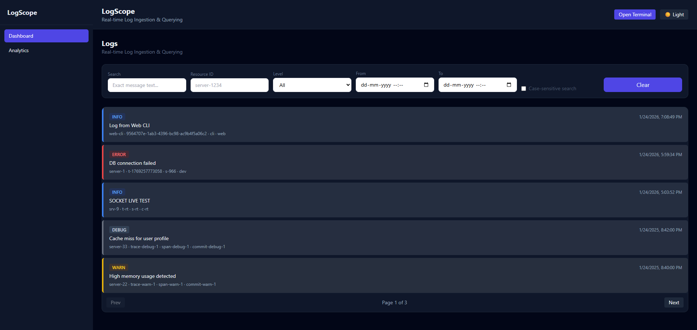
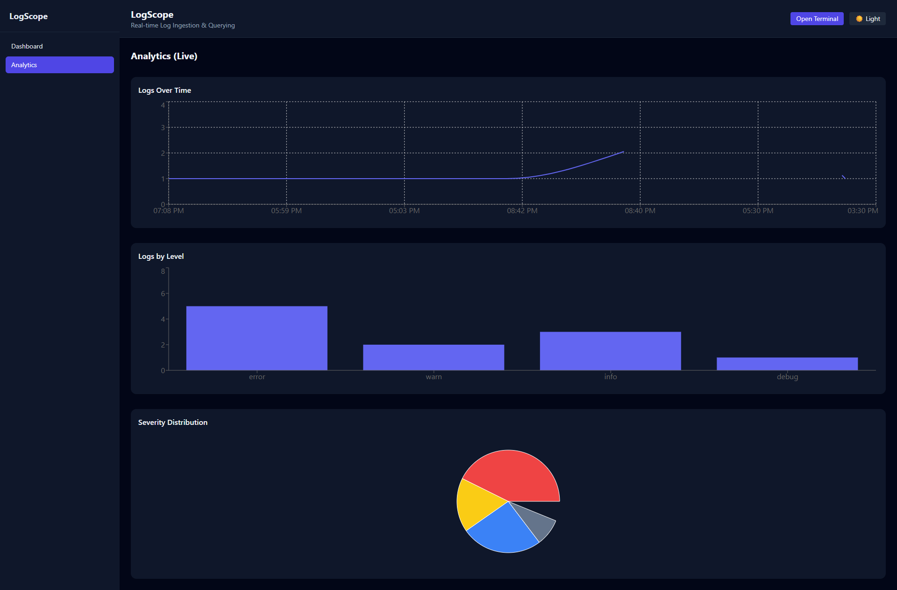
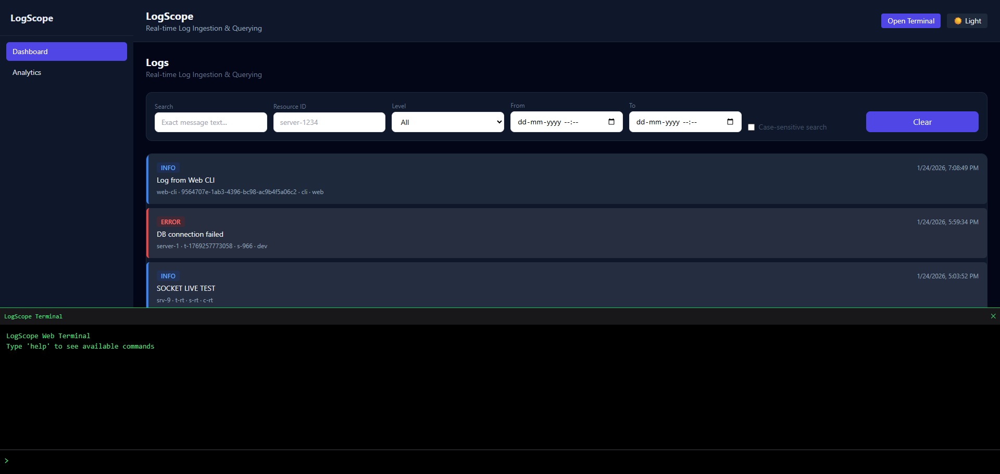

# LogScope 🔍  
**Real-Time Log Ingestion & Querying System**

[](LICENSE)\
[]\
[]\
[]\
[]\
[]

LogScope is a full-stack, Dockerized log ingestion and querying platform inspired by **Datadog, Grafana Loki, and Splunk**.  
It allows developers to send logs from any service, persist them in a JSON file, and query them in real time via a rich React UI.

---
## 📑 Table of Contents

- [Features](#features)
- [UI Preview](#ui-preview)
- [Monorepo Structure](#monorepo-structure)
- [Installation & Setup](#installation)
- [API Reference](#api-reference)
- [Filtering Logic](#filtering-logic)
- [Analytics](#analytics)
- [Docker Architecture](#docker-architecture)
- [CI/CD Pipeline](#cicd)
- [Development (without Docker)](#dev)
- [Example Test](#example-test)
- [Tech Stack](#tech-stack)
- [Design Decisions](#design-decisions)
- [Contributing](#contributing)
- [Author](#author)


<a id="features"></a>
## 🚀 Features

### 🔹 Backend
- `POST /logs` — Ingest structured logs  
- `GET /logs` — Query logs using multiple filters  
- JSON file datastore (no database)  
- Atomic file writes + lock protection  
- Real-time updates via WebSockets (Socket.IO)  
- Safe schema validation (Zod)  

### 🔹 Frontend
- Full-text message search (debounced)  
- Filters:
  - Level (error, warn, info, debug)
  - resourceId
  - Date/time range  
- AND-combined filtering logic  
- Real-time log streaming  
- Color-coded severity indicators  
- Analytics dashboard (Recharts)  

### 🔹 DevOps
- Dockerized frontend + backend  
- `docker compose up` → full stack  
- GitHub Actions CI/CD → Docker Hub  
- Nginx static serving for frontend  
- Volume-backed persistence  

---
<a id="ui-preview"></a>
## 📸 UI Preview

Replace these with your screenshots:





<a id="monorepo-structure"></a>
## 📁 Monorepo Structure


```bash
log-ingestion/
├── .github/
│   └── workflows/
│       └── docker-ci.yml
│
├── docker-ci.yml
├── docker-compose.yml
│
├── backend/
│   ├── data/
│   │   └── logs.json
│   │
│   ├── node_modules/
│   │
│   ├── routes/
│   │   └── logs.js
│   │
│   ├── docs/
│   │   └── apidocgen.md
│   │
│   ├── Dockerfile
│   ├── package.json
│   ├── package-lock.json
│   └── server.js
│
├── frontend/
│   ├── node_modules/
│   ├── public/
│   │   └── vite.svg
│   │
│   ├── src/
│   │   ├── api/
│   │   │   └── logsApi.js
│   │   │
│   │   ├── assets/
│   │   │   └── react.svg
│   │   │
│   │   ├── components/
│   │   │   ├── FilterBar/
│   │   │   │   └── FilterBar.jsx
│   │   │   │
│   │   │   ├── LogChart/
│   │   │   │   └── LogChart.jsx
│   │   │   │
│   │   │   ├── LogsList/
│   │   │   │   └── LogsList.jsx
│   │   │   │
│   │   │   ├── LogsPanel/
│   │   │   │   └── LogsPanel.jsx
│   │   │   │
│   │   │   ├── WebUI/
│   │   │   │   └── WebUI.jsx
│   │   │   │
│   │   │   └── sidebar.jsx
│   │   │
│   │   ├── hooks/
│   │   │   └── useLogs.js
│   │   │
│   │   ├── layout/
│   │   │   └── shell.jsx
│   │   │
│   │   ├── pages/
│   │   │   └── Dashboard.jsx
│   │   │
│   │   ├── services/
│   │   │   └── socket.js
│   │   │
│   │   ├── styles/
│   │   │   └── app.css
│   │   │
│   │   ├── App.jsx
│   │   ├── App.css
│   │   ├── index.css
│   │   └── main.jsx
│   │
│   ├── Dockerfile
│   ├── nginx.conf
│   ├── .dockerignore
│   ├── .gitignore
│   ├── eslint.config.js
│   ├── index.html
│   ├── package.json
│   ├── package-lock.json
│   ├── postcss.config.js
│   ├── tailwind.config.js
│   └── vite.config.js
│
└── README.md
```
<a id="installation"></a>
## ⚙️ Installation & Setup
### 1️⃣ Clone
```
git clone https://github.com/your-username/logscope.git
cd logscope
```
| Service     | URL                         |
|------------|-----------------------------|
| Frontend   | http://localhost:5173       |
| Backend API| http://localhost:3001/logs  |

### 2️⃣ Docker (Recommended)
```
docker compose up --build

```
<a id="api-reference"></a>
## 🔌 API Reference

### POST /logs

Ingest a structured log entry.

#### Request Body

```json
{
  "level": "error",
  "message": "DB connection failed",
  "resourceId": "server-1",
  "timestamp": "2026-01-24T12:29:34.466Z",
  "traceId": "t-1769",
  "spanId": "s-966",
  "commit": "dev",
  "metadata": { "host": "prod" }
}
```
### GET /logs (Filters)

Query logs using multiple filters.

#### Example Requests
```bash
/logs?level=error&message=db&resourceId=server-1
/logs?from=2026-01-23T00:00:00Z&to=2026-01-26T00:00:00Z
```
<a id="filtering-logic"></a>
## 🧠 Filtering Logic

All filters use **AND** logic:

```js
results.filter(log =>
  matchesLevel &&
  matchesMessage &&
  matchesResource &&
  matchesDateRange
);
```

```bash
/logs?level=error&message=db&resourceId=server-1
/logs?from=2026-01-23T00:00:00Z&to=2026-01-26T00:00:00Z
```
<a id="analytics"></a>
## 📊 Analytics

- Log count by level

- Uses Recharts

- Auto-updates based on current filters

<a id="docker-architecture"></a>
## 🐳 Docker Architecture
```
[ Browser ]
     ↓
[ Frontend (Nginx) ]
     ↓
[ Backend (Node.js) ]
     ↓
[ logs.json volume ]

```
<a id="cicd"></a>
## 🔁 CI/CD Pipeline
```
Trigger: push to main

Builds backend + frontend

Pushes images to Docker Hub
```
### GitHub Secrets
```
DOCKER_USERNAME
DOCKER_PASSWORD

```
------
<a id="dev"></a>
## 🛠 Development (without Docker)
### Backend
```
cd backend
npm install
node server.js

```
### Frontend
```
cd frontend
npm install
npm run dev

```
<a id="example-test"></a>
## 🧪 Example Test
```
curl -X POST http://localhost:3001/logs \
-H "Content-Type: application/json" \
-d '{...}'

```
<a id="tech-stack"></a>
## 🧩 Tech Stack

| Layer     | Tech                                   |
|-----------|----------------------------------------|
| Backend   | Node.js, Express, Zod, fs-extra         |
| Realtime  | Socket.IO                              |
| Frontend  | React, Vite, Tailwind, Recharts         |
| DevOps    | Docker, Compose, GitHub Actions         |
| Storage   | JSON File                              |

<a id="design-decisions"></a>
## 📌 Design Decisions

- JSON DB → matches assessment constraints

- Atomic writes → prevents corruption

- WebSockets → real-time observability

- Monorepo → easier CI/CD and reuse
  
<a id="contributing"></a>
## 👥 Contributing

1) Fork

2) Create branch

3) Commit

4) PR

<a id="author"></a>
## 📞 Author

**Sankha Subhra Das**
- Portfolio: [https://www.sankhasubhradasportfolio.in/]
- GitHub: [https://github.com/sankha1545]
- Email - [sankhasubhradas1@gmail.com]
- LinkedIn - [https://www.linkedin.com/in/sankha-subhra-das-625ab6201/]

**“Logs are the heartbeat of production systems.”**

